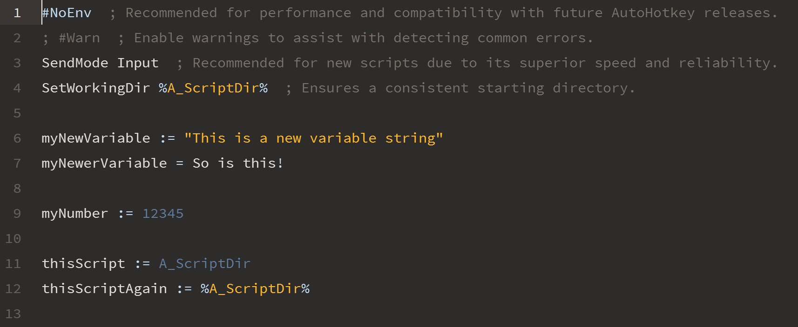

# AutoHotKey syntax-highlighting for Atom

This package adds basic syntax highlighting support for .ahk files in Atom.

Screenshot taken of "New AutoHotKey Script.ahk" included in the project.  

Props to Dayle Rees and his beautifully designed *Revalation* theme: [daylerees/colour-schemes](https://github.com/daylerees/colour-schemes "daylerees/colour-schemes") 

## Features
This package includes syntax highlighting for the following AutoHotkey constructs:
  * Built-in variables
  * Commands
  * Directives
  * Quoted string literals
  * Line & block comments
  * Numeric literals
  * Operators
